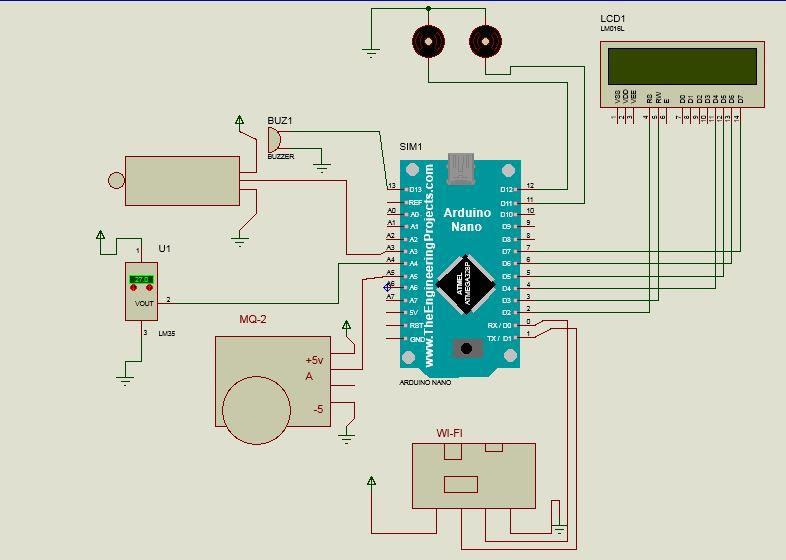
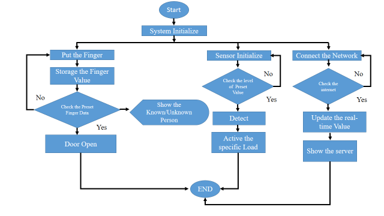
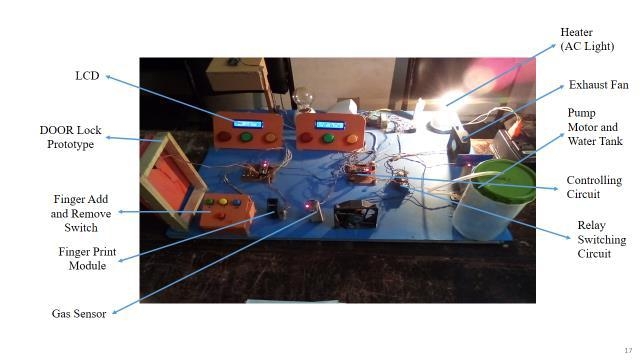

# A Simplified Home Environment System (ASHES) 🏠📡

This project is a smart home automation and security system built using Arduino and IoT technologies. It combines fingerprint-based access control, environmental monitoring (fire, gas, temperature), and remote alerting through the internet — designed and implemented as a B.Sc. thesis project.

---

## 📂 Folder Structure

A Simplified Home Environment system/
├── codes/
│   ├── bio.ino
│   └── fgt.ino
├── images/
│   ├── circuit-diagram.png
│   ├── final-setup.jpg
│   └── flow-chart.png
└── README.md

---

## 🔧 Key Features

- 🔐 **Fingerprint authentication** for secured door access.
- 🌡️ **Temperature monitoring** and automated control.
- 🔥 **Fire and gas detection** using flame and MQ-2 sensors.
- 🧠 **Automated responses**: fans, pump motors, lights triggered as needed.
- 🌐 **IoT-based monitoring** using ESP8266 and remote data logging.
- 📺 Real-time LCD display for environmental readings and status.
- 💡 Efficient, scalable and cost-effective for home environments.

---

## 🧠 System Overview

### 📷 Circuit Diagram  

### 🔁 Flow Chart  

### 🛠️ Final Hardware Setup  

---

## 📦 Components Used

- Arduino Nano
- ESP8266 Wi-Fi module
- Flame Sensor
- MQ-2 Gas Sensor
- LM35 Temperature Sensor
- 16x2 LCD Display
- Fingerprint Sensor (R305)
- Relay modules
- Pump motor
- Buzzer
- Power adapters (5V, 12V)

---

## 🚀 How to Use

1. Upload `bio.ino` and `fgt.ino` to your Arduino Nano using the Arduino IDE.
2. Power the circuit using regulated 5V and 3.3V sources.
3. Connect the ESP8266 to your local Wi-Fi network using AT commands (handled in code).
4. Enroll fingerprints via serial using the fingerprint sensor module.
5. Monitor and control the home environment remotely through cloud/server integration.
6. LCD displays live sensor readings and security status.

---

## 🔮 Future Improvements

- 📲 Mobile app integration for real-time notifications
- 📷 Add camera support for visual surveillance
- ⚙️ Use professional-grade sensors
- 🔋 Add power backup and solar support
- 📡 Integrate MQTT or Blynk for better IoT management

---

## 👥 Authors

- **Seam Bin Aftab**  
- **Mitul Baidya**

Project submitted as part of B.Sc. in Computer Science and Engineering at **International Islamic University Chittagong (IIUC)**, 2022.

Supervised by **Md. Ziaur Rahman**, Lecturer, Dept. of CSE, IIUC.

---

## 📝 License

This project is open-source. Feel free to fork, modify, and improve. Add an appropriate license (`MIT`, `Apache`, etc.) if you wish to formalize contributions.

---